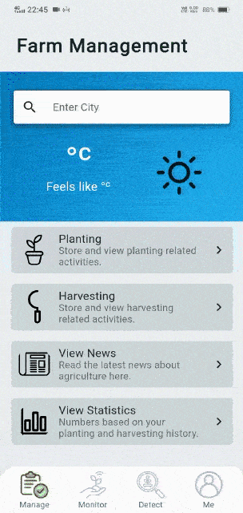
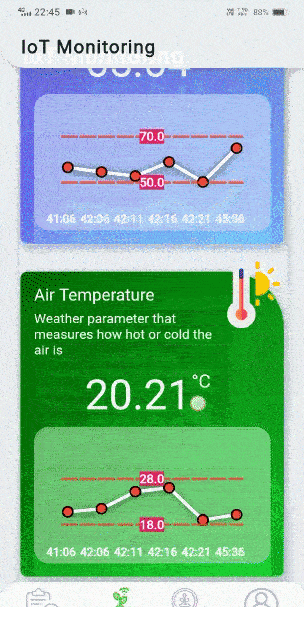
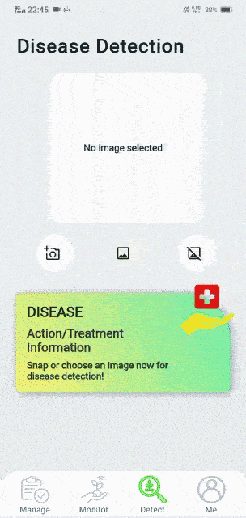
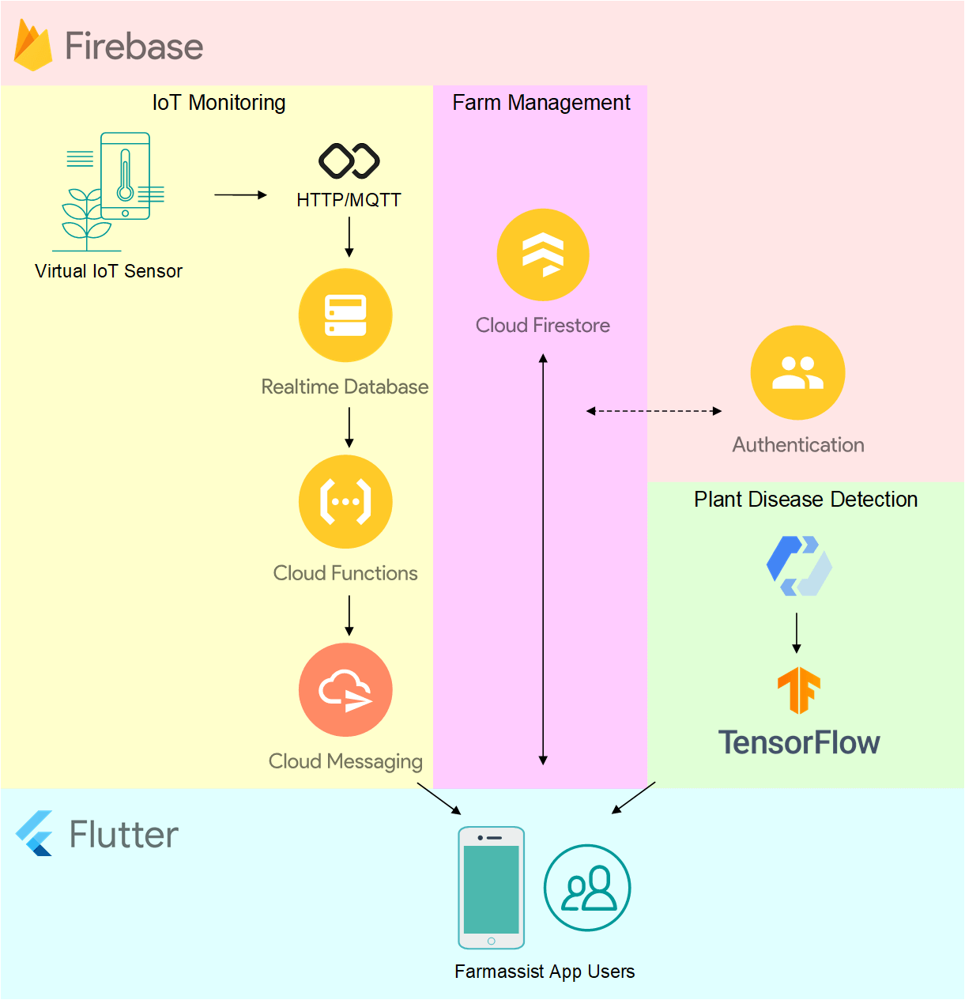

# Farmassist

<p align=center></p>

Farmassist is a smart farming app for IoT and AI-powered plant disease detection. It is built with Flutter and uses Firebase as its backend.

### App Screenshots

|  |  |  |
| :----------------------------------: | :------------------------------------: | :---------------------------------------: |
|       _View Agricultural News_       |      _Receive IoT Telemetry Data_      |          _Detect Plant Disease_           |

### Download Android APK

You can download the latest version of the Android APK [here](https://github.com/farmassistX/farmassist/releases/tag/v1.0.21).

## Architecture

<p align=center></p>
<p align="center"><i>Architecture Diagram of Farmassist</i></p>

The above illustration shows a high level overview of the Farmassist project. Farmassist consists of 3 subsystems:

- [Farm Management Subsystem](#farm-management): Users can view agricultural news and manage planting and harvesting data.
- [IoT Monitoring Subsystem](#iot-monitoring): Users can view IoT telemetry data from the farm in the form of charts and receive alert notifications for abnormal telemetry data.
- [Plant Disease Detection Subsystem](#plant-disease-detection): Users can take a picture of a diseased plant via camera to detect the disease type.

The backend services used are as follows:

- [Firebase Authentication](https://firebase.google.com/products/auth)
- [Cloud Firestore](https://firebase.google.com/products/firestore)
- [Realtime Database](https://firebase.google.com/products/realtime-database)
- [Cloud Functions](https://firebase.google.com/products/functions)
- [Cloud Messaging](https://firebase.google.com/products/cloud-messaging)
- [Google Cloud AutoML Vision](https://cloud.google.com/automl)

The following sections explain more detail about the services and components used by the corresponding subsystems.

## Authentication and User Profile

The signup and login flow of Farmassist is developed using the [Bloc](https://bloclibrary.dev/#/) library and Firebase Authentication. After a user signs up successfully, the user data will be stored in the data model of Cloud Firestore as shown below:

```
{
  "users": { // "users" collection
    "4lbwvicymz71LfY9POHZ": { // "userId" document
      "id": "4lbwvicymz71LfY9POHZ",
      "email": "example@farmassist.com",
      "displayName": "Jack",
      "tokens": [ ... ] // used by Cloud Messaging
    },
    "4DkFgqNdjZnEh78YmsE3": { ... },
    // more "userId" documents
  }
}
```

## Farm Management

Cloud Firestore, a NoSQL, document-oriented database, is used to store farm management data using key-value pairs. In Cloud Firestore, each collection consists of a number of documents in which each document can store a number of subcollections.

There are 2 types of farm management data stored: **planting data** and **harvesting data**. An example of the data model for harvesting data is shown below:

```
{
  "planting": { // "planting" collection
    "4lbwvicymz71LfY9POHZ": { // "userId" document
      "months": { // "months" subcollection
        "jan": { // "jan" document
          "plantName": "tomato",
          "noOfPlants": "100",
          "plantDate": "25-03-2021",
          "estimatedHarvestWeek": "9",
          "harvestDate": "25-5-2021",
          "harvested": true
        },
        "feb": { ... } // "feb" document
        // more documents for the remaining months
      }
    },
    // more "userId" documents
  }
}
```

Under farm management, 2 extra APIs are used:

- [News API](https://newsapi.org/docs/endpoints/top-headlines) is used to fetch top headlines for science category.
- [OpenWeather API](https://openweathermap.org/current) is used to obtain weather data of the farm location.

## IoT Monitoring

Realtime Database acts as a repository of IoT telemetry data that performs data synchronization with the Farmassist app. The overall process of IoT monitoring is described as follows:

1. When new telemetry data is stored in Realtime Database, Cloud Functions will be triggered.
2. Cloud Functions execute a function to check for abnormal values in the received telemetry data.
3. If abnormal values exist, Cloud Functions will call Cloud Messaging service to send an alert notification to the relevant app user, which is identified by a unique token.

5 types of telemetry data are stored as JSON objects in Realtime Database:

- Air Humidity (%)
- Air Temperature (°C)
- Soil Moisture (%)
- Soil pH (pH)
- Soil Salinity (Millisiemens/cm)

Each telemetry data is stored as a key-value pair of timestamp and value. An example of the data model for telemetry data is shown below:

```
{
  "telemetry_data": {
    "4lbwvicymz71LfY9POHZ": { // userId
      "humidity": {
        "1617979596947": "56.64", // timestamp: value
        "1617979596949": "55.89",
        // more values
      },
      "moisture": { ... },
      "pH": { ... },
      "salinity": { ... },
      "temperature": { ... }
    },
    // more telemetry data from other users
  }
}
```

For demonstration purpose, a minimal IoT device simulator is built to send telemetry data to Realtime Database. For more information, you can refer to [Farmassist IoT Device Simulator](https://github.com/farmassistX/farmassist-iot-device-simulator).

The code for Cloud Functions can be found in [Farmassist Firebase](https://github.com/farmassistX/farmassist-firebase).

## Plant Disease Detection

A plant disease detection model was trained using Google Cloud AutoML Vision. The training dataset is a subset of [PlantVillage dataset from Mendeley Data](https://data.mendeley.com/datasets/tywbtsjrjv/1). A total of 2,941 diseased plant images that consists of 6 disease categories were used:

- Corn Common Rust (500 images)
- Corn Gray Leaf Spot (441 images)
- Potato Early Blight (500 images)
- Strawberry Leaf Scorch (500 images)
- Tomato Leaf Mold (500 images)
- Tomato Mosaic Virus (500 images)

After training, the model was exported as a [TensorFlow Lite](https://www.tensorflow.org/lite) model, which is suitable to be run on a mobile device. You can find the trained model [here](/assets/model.tflite).

## Flutter Packages Used

Some of the useful Flutter packages used in the Farmassist app are listed in the table below. Refer to [pubspec.yaml](pubspec.yaml) for the complete package information.

|                                                                     Package                                                                     | Functions                                                                                                                                       |
| :---------------------------------------------------------------------------------------------------------------------------------------------: | ----------------------------------------------------------------------------------------------------------------------------------------------- |
|                                                  [Provider](https://pub.dev/packages/provider)                                                  | A simple state management tool                                                                                                                  |
| [bloc](https://bloclibrary.dev/#/) and [flutter_bloc](https://pub.dev/documentation/flutter_bloc/latest/flutter_bloc/flutter_bloc-library.html) | A state management library implemented using [BLoC](https://www.raywenderlich.com/4074597-getting-started-with-the-bloc-pattern) design pattern |
|                                                  [fl_chart](https://pub.dev/packages/fl_chart)                                                  | A powerful Flutter chart library with beautiful UI                                                                                              |
|                                                 [getwidget](https://pub.dev/packages/getwidget)                                                 | A Flutter UI library with 1000+ pre-made UI components                                                                                          |

## Setup

Things to do if you want to fork or contribute to the project.

1. [Create a Firebase project and add Firebase to your Flutter app](https://firebase.google.com/docs/flutter/setup?platform=android).
2. Refer to [Farmassist IoT Device Simulator](https://github.com/farmassistX/farmassist-iot-device-simulator) to see how fake telemetery data can be sent to Realtime Database.
3. Refer to [Farmassist Firebase](https://github.com/farmassistX/farmassist-firebase) for the Cloud Functions code that call Cloud Messaging service.
4. Refer to [Edge Device Model Quickstart](https://cloud.google.com/vision/automl/docs/edge-quickstart) if you want to train your own model for plant disease detection.
5. Refer to [CI/CD for Flutter Apps Using GitHub Actions](https://betterprogramming.pub/ci-cd-for-flutter-apps-using-github-actions-b833f8f7aac) to set up a workflow that can release an APK for your Flutter app whenever someone pushes the code to GitHub. Instead of using `push` event, I set up a manual trigger with `workflow_dispatch` event.

## References

- [GitHub: Farmassist IoT Device Simulator](https://github.com/farmassistX/farmassist-iot-device-simulator)
- [GitHub: Farmassist Firebase](https://github.com/farmassistX/farmassist-firebase)
- [Bloc: Flutter Firebase Login Tutorial](https://bloclibrary.dev/#/flutterfirebaselogintutorial)
- [FlutterFire: Cloud Messaging Usage](https://firebase.flutter.dev/docs/messaging/usage)
- [Google Cloud AutoML Vision: Edge Device Model Quickstart](https://cloud.google.com/vision/automl/docs/edge-quickstart)
- [Medium: AutoML Vision—How To Train Your Model?](https://towardsdatascience.com/automl-vision-how-to-train-your-model-c7e887051453)
- [Medium: CI/CD for Flutter Apps Using GitHub Actions](https://betterprogramming.pub/ci-cd-for-flutter-apps-using-github-actions-b833f8f7aac)
- [GitHub: Farmsmart Flutter App](https://github.com/farmsmart/farmsmart-flutter)
- [GitHub: Best Flutter UI Templates](https://github.com/mitesh77/Best-Flutter-UI-Templates)
